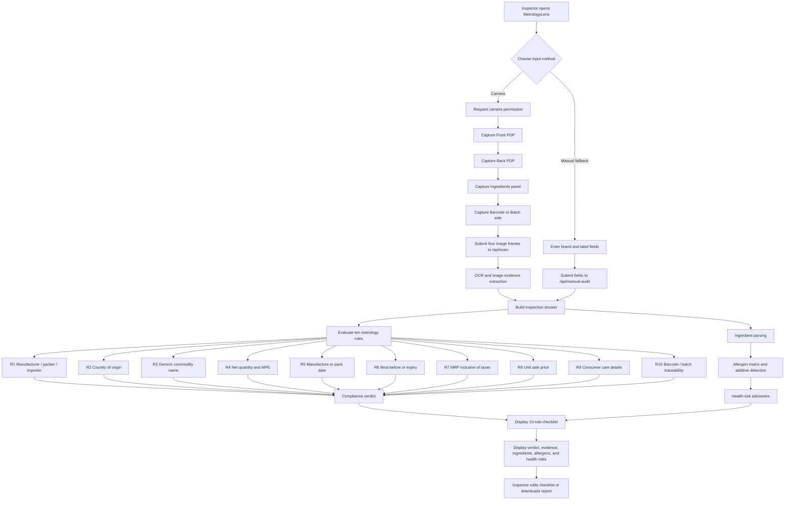

# MetrologyLens: Programming Languages and Application Flow

## 1. Purpose

MetrologyLens is a camera-led package inspection application. Its primary workflow captures package panels, extracts label evidence, evaluates ten metrology rules, and presents a verdict with ingredient, allergen, and health-risk information.

The current demonstration catalog contains five seeded chips brands. The seeded company values are reference data for demonstration and must be replaced by verified manufacturer declarations before operational or enforcement use.

## 2. Programming languages and formats

| Language or format | Where it is used | Purpose |
|---|---|---|
| **TypeScript** | `client/src`, `server`, `shared`, `drizzle` | Main application language. It provides typed React components, Express routes, OCR/compliance contracts, health analysis, and database schemas. |
| **TSX** | `client/src/pages/Home.tsx` and React components | TypeScript with JSX for the browser user interface. |
| **CSS** | `client/src/index.css` | Responsive layout, mobile app navigation, camera console, checklist, verdict panels, and visual theme. |
| **HTML** | `client/index.html` | Browser document shell, metadata, fonts, and application mount point. |
| **SQL** | `drizzle/migrations` and Drizzle-generated migrations | Relational database migration definitions. |
| **JSON** | `package.json`, `manifest.json`, configuration files, API payloads | Dependency configuration, PWA metadata, and structured request/response data. |
| **SVG** | `client/public/metrology-icon.svg` | Installable app icon. |
| **JavaScript service worker** | `client/public/sw.js` | Production app-shell caching and offline fallback behavior. |

## 3. Main frameworks and runtime components

| Layer | Technology | Role |
|---|---|---|
| Browser interface | React 19 + Vite | Renders the scan console, camera dialog, checklist, verdicts, ingredients, allergens, and health panels. |
| Styling | Tailwind CSS 4 utilities plus project CSS | Provides responsive and mobile-first presentation. |
| Server | Node.js + Express | Hosts the web application and compliance REST endpoints. |
| Typed RPC infrastructure | tRPC | Provides the application’s typed server contract and authentication procedures. |
| Compliance logic | TypeScript modules | Evaluates declarations, quantity tolerance, pricing, dates, traceability, ingredients, allergens, and health risks. |
| Database layer | Drizzle ORM + MySQL/TiDB connector | Supports user and application persistence where configured. |
| Testing | Vitest | Runs authentication and compliance fixture tests. |
| Build tools | Vite + esbuild + pnpm | Builds the browser bundle and server bundle. |

## 4. End-to-end application flow

## 5. Scan workflow in plain language

The inspector starts the scan from the primary **Start package scan** action. The application requests camera access and guides the inspector through four panels: the front principal display panel, the back principal display panel, the ingredients panel, and the barcode or batch side.

The captured frames are submitted together as one inspection dossier. The server extracts or receives label evidence and evaluates the ten metrology rules. The result is returned to the browser and populates the checklist, verdict, declarations ledger, ingredient table, allergen matrix, and health-risk panel.

If the camera workflow cannot be used, the manual fallback accepts a typed brand or product name together with selected label measurements. Known demo brands can be matched to the seeded chips catalog. A scan of a product outside that catalog can still receive a generic inspection result, but it should not be treated as a verified company-profile match.

## 6. Important project modules

| Module | Responsibility |
|---|---|
| `client/src/pages/Home.tsx` | Main scan-first interface, camera capture, checklist, verdicts, and health panels. |
| `client/src/index.css` | Responsive design and mobile app layout. |
| `server/compliance/app.ts` | Express endpoints for scans, manual audits, batches, discrepancies, and exports. |
| `server/compliance/compliance_rules.ts` | Legal-metrology evaluation and verdict calculation. |
| `server/compliance/ocr_engine.ts` | OCR result contracts and confidence evidence. |
| `server/compliance/health_engine.ts` | Ingredient, additive, allergen, lifestyle, and chronic-risk analysis. |
| `server/compliance/chips_datasets.ts` | Five-brand company master dataset and ten-rule reference dataset. |
| `server/compliance/image_pipeline.ts` | Image preprocessing metadata and pipeline contracts. |
| `server/compliance/fixtures.ts` | Demonstration inspection dossiers and product fixtures. |
| `server/routers.ts` | tRPC application router and authentication procedures. |
| `drizzle/schema.ts` | Database schema definitions. |

## References

[1]: https://www.typescriptlang.org/docs/ "TypeScript Documentation"
[2]: https://react.dev/ "React Documentation"
[3]: https://expressjs.com/ "Express Documentation"
[4]: https://www.vite.dev/guide/ "Vite Guide"
[5]: https://orm.drizzle.team/docs/overview "Drizzle ORM Documentation"
[6]: https://vitest.dev/guide/ "Vitest Documentation"

## 7. Routed page architecture

The current interface is divided into dedicated pages instead of one long scrolling document. Home is the scan-first entry point. Scan owns camera capture. Rules owns the editable ten-rule checklist. Verdicts owns compliance outcomes. Health owns allergens and health risks. History stores local scan records on the device. Modes contains Consumer / Officer, Company, and Admin workspaces. Assistant contains the guided chatbot.

The Admin workspace writes catalog amendments to the `product_catalog_amendments` database table through the catalog API. The Company workspace highlights rules that a selected product does not satisfy. The Consumer / Officer workspace links the complete inspection workflow.
